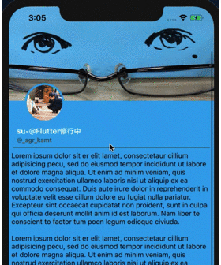

# TwitterLikeHeaderExample

An example of Header Animation like Twitter iOS App.  
Header almost consists of using **AutoLayout** and change programatically only scale of profileImage and alpha of blur.

## GIF

## Special Thanks

- [Tweet from @_asa08_](https://twitter.com/_asa08_/status/1217327574516256769)
- [Auto Layout の静的な制約で実現する伸び縮みするヘッダービュー](https://blog.kishikawakatsumi.com/entry/2018/11/05/044228)
